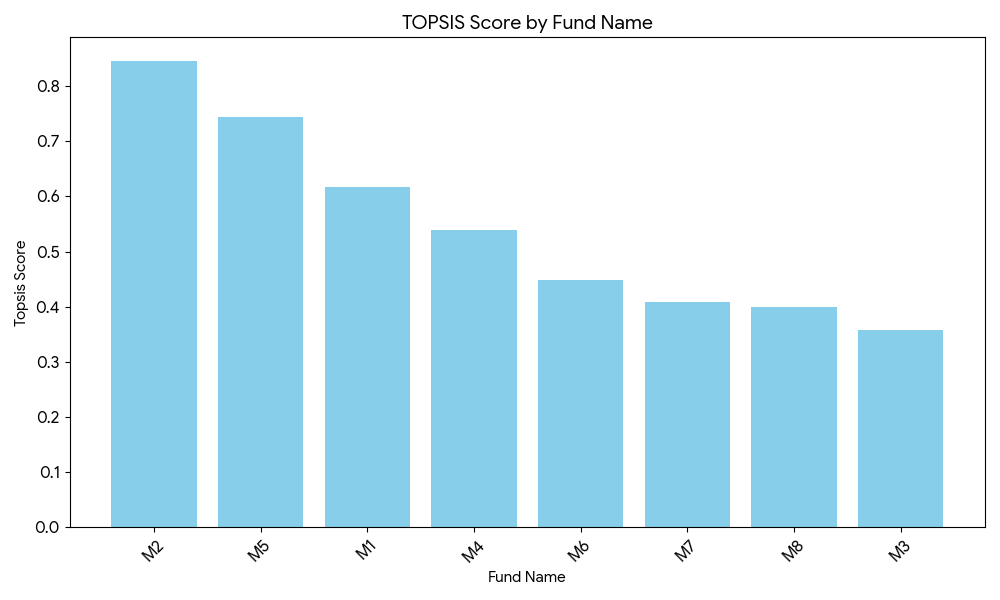

# TOPSIS Analysis for Fund Selection

## 1. Project Overview
This project applies the **TOPSIS** (Technique for Order of Preference by Similarity to Ideal Solution) method to rank various mutual funds based on multiple performance criteria. The goal is to identify the best fund that balances maximizing benefits (like returns) and minimizing costs (like risk or expense ratios).

## 2. Methodology

The analysis follows the standard TOPSIS algorithm steps:

### Step 1: Data Preprocessing
The dataset consists of $m$ alternatives (funds) and $n$ criteria ($P1, P2, \dots, P5$).
* **Input File**: `data.csv`
* **Weights Assigned**: `1, 1, 1, 2, 1` (Criterion P4 is given double importance).
* **Impacts Assigned**: `+, +, -, +, +`
    * `+` (Benefit): Higher value is preferred (e.g., P1, P2, P4, P5).
    * `-` (Cost): Lower value is preferred (e.g., P3).

### Step 2: Vector Normalization
Each value $x_{ij}$ in the decision matrix is normalized to $r_{ij}$ using the formula:
$$r_{ij} = \frac{x_{ij}}{\sqrt{\sum_{k=1}^{m} x_{kj}^2}}$$
This transforms various criteria dimensions into a non-dimensional format.

### Step 3: Weighted Normalized Decision Matrix
The weighted normalized values $v_{ij}$ are calculated by multiplying the normalized values by their associated weights $w_j$:
$$v_{ij} = w_j \times r_{ij}$$

### Step 4: Determine Ideal Best and Ideal Worst Solutions
* **Ideal Best ($V^+$)**: The maximum value for benefit criteria and minimum for cost criteria.
* **Ideal Worst ($V^-$)**: The minimum value for benefit criteria and maximum for cost criteria.

### Step 5: Calculate Euclidean Distances
For each alternative, calculate the distance from the ideal best ($S_i^+$) and ideal worst ($S_i^-$):
$$S_i^+ = \sqrt{\sum_{j=1}^{n} (v_{ij} - v_j^+)^2}$$
$$S_i^- = \sqrt{\sum_{j=1}^{n} (v_{ij} - v_j^-)^2}$$

### Step 6: Calculate Performance Score & Ranking
The TOPSIS score ($P_i$) is calculated as:
$$P_i = \frac{S_i^-}{S_i^+ + S_i^-}$$
* The score ranges from 0 to 1.
* **Rank 1** is assigned to the fund with the highest score.

---

## 3. Results

### Result Table
The following table shows the calculated TOPSIS score and the final ranking for each fund. **M2** is identified as the best fund.

| Fund Name | P1 | P2 | P3 | P4 | P5 | Topsis Score | Rank |
| :--- | :--- | :--- | :--- | :--- | :--- | :--- | :--- |
| **M2** | 0.86 | 0.74 | 4.3 | 63.0 | 17.23 | **0.8462** | **1** |
| M5 | 0.79 | 0.62 | 3.1 | 55.2 | 14.93 | 0.7448 | 2 |
| M1 | 0.76 | 0.58 | 4.2 | 52.1 | 14.41 | 0.6175 | 3 |
| M4 | 0.72 | 0.52 | 6.4 | 57.0 | 16.16 | 0.5387 | 4 |
| M6 | 0.88 | 0.77 | 3.4 | 33.6 | 9.66 | 0.4476 | 5 |
| M7 | 0.63 | 0.40 | 3.3 | 42.0 | 11.58 | 0.4085 | 6 |
| M8 | 0.60 | 0.36 | 3.9 | 44.8 | 12.42 | 0.4079 | 7 |
| M3 | 0.73 | 0.53 | 4.5 | 40.4 | 11.54 | 0.3571 | 8 |

### Result Analysis
* **Winner**: **M2** achieved the highest score (0.8462), largely driven by its strong performance in the highly weighted P4 criterion and solid values across other benefit criteria.
* **Runner-up**: **M5** followed with a score of 0.7448.
* **Last Place**: **M3** ranked lowest due to weaker performance relative to the ideal best solution.

### Result Graph
The bar chart below visualizes the TOPSIS scores. Higher bars indicate better performance.

*(Note: Add the image `result_graph.png` here in your repository)*


## 4. How to Run
To reproduce these results, execute the following command in your terminal:

```bash
python Topsis.py data.csv "1,1,1,2,1" "+,+,-,+,+" result.csv
